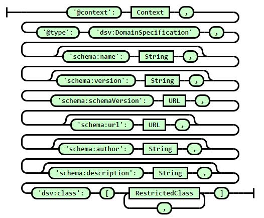
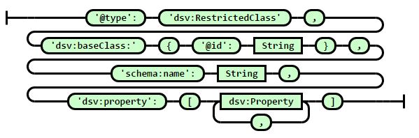
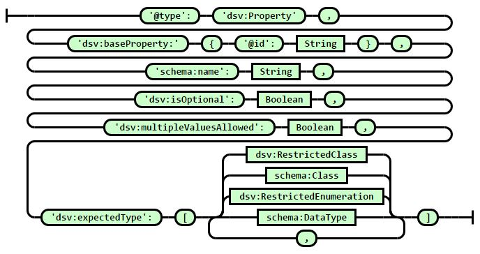
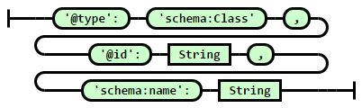
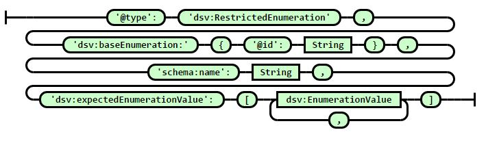
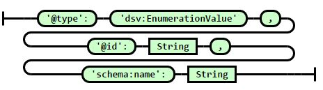

# DS-V1 - Grammar

The grammar for DS-V1 is given below in [BNF](https://en.wikipedia.org/wiki/Backus%E2%80%93Naur_form). The grammar consists of 7 different node-types, that are used to construct a Domain Specification. A Domain Specification is tree-shaped JSON-LD, like the annotations it should represent.

## Domain Specification Node

The **Domain Specification Node** is the start-node (aka. root-node) for a Domain Specification. 



It contains the `@context` for the whole document, which includes only schema.org and the (virtual) DS Vocabulary:

```json
"@context": {
    "dsv": "http://ontologies.sti-innsbruck.at/dsv/",
    "schema": "http://schema.org/"
}
```

`dsv:class` holds an array of possible restricted Classes that this DS would allow. If an annotation complies to at least one of these restricted classes, the annotation would be in compliance to the DS.

## Restricted Class Node

A **Restricted Class Node** is used to represent a Class from schema.org (`dsv:baseClass`) that has a specific set of further specified properties (`dsv:property`).



## Property Node

A **Property Node** is used to represent a Property from schema.org (`dsv:baseProperty`) that has cardinality constraints (`dsv:isOptional` and `dsv:multipleValuesAllowed`), and a specific set of further specified ranges (`dsv:expectedType`).



## Class Node

A **Class Node** is used to represent a Class from schema.org (`@id`). In this case no further constraints are given: the corresponding Class may have any set of properties allowed by schema.org for this class.



## Restricted Enumeration Node

A **Restricted Enumeration Node** is used to represent an Enumeration from schema.org (`dsv:baseEnumeration`) that has a specific set of further specified enumeration values = valid instances (`dsv:expectedEnumerationValue`).



## Enumeration Value Node

An **Enumeration Value Node** is used to represent an Enumeration Value from schema.org (`@id`).



## Data Type Node

A **Data Type Node** is used to represent a Data Type from schema.org (`@id`).

