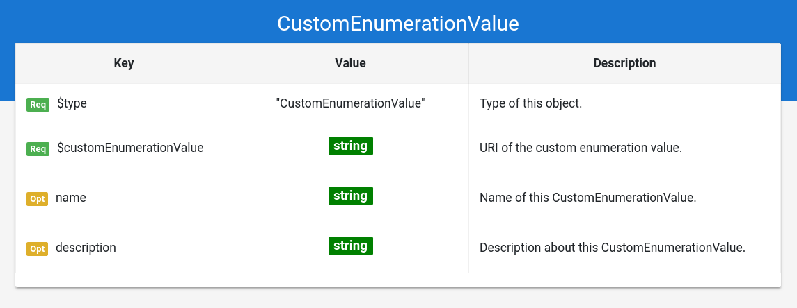

## Grammar Documentation for node type "CustomEnumerationValue"

This is a node specifying the usage of a custom enumeration value instance.

This node should allow the usage of value instances that are NOT stated as an enumeration value instance by Schema.org. 

Usually, enumerations have a set of valid instances for that enumeration:

e.g. https://schema.org/EBook is an enumeration value instance for the enumeration https://schema.org/BookFormatType

But there are also enumerations, which do not specify such a set of valid instances; There is a set of "commonly used values" at most, which are in the description of the enumeration:

e.g. https://schema.org/PaymentMethod is an enumeration without enumeration value instances. However, the description lists a set of commonly used values for this enumeration (which are not part of Schema.org), e.g. http://purl.org/goodrelations/v1#DirectDebit

The node type "CustomEnumerationValue" enables the definition and usage of such external enumeration values. 

### $type
**Required**. Has always the string "CustomEnumerationValue" as value.

Based on "@type" from JSON-LD (Indicates the type of the node/object). This value is a short form for the URI identifying this node type in the DS grammar.

### $customEnumerationValue
**Required**. Has always a string as value.

The string must be an URI for the custom enumeration value, e.g. "http://purl.org/goodrelations/v1#DirectDebit"

### name
**Optional**. Has always a string as value.

Same as the property "name" from Schema.org (meta information about the entity).

### description
**Optional**. Has always a string as value.

Same as the property "description" from Schema.org (meta information about the entity).
