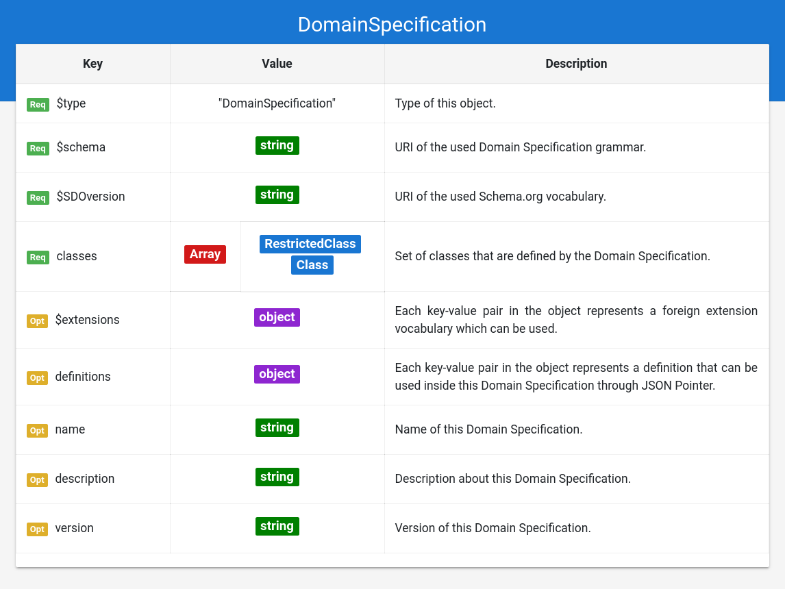

## Grammar Documentation for node type "DomainSpecification"

This is the root node of a Domain Specification. It specifies used vocabularies, definitions for references, and meta information about the Domain Specification.



### $type
**Required**.
Has always the string "DomainSpecification" as value.

Based on "@ type" from JSON-LD (Indicates the type of the node/object). This value is a short form for the URI identifying this node type in the DS grammar.

### $schema
**Required**. Has always a string (URI) as value.

 Based on "$schema" from JSON Schema (Indicates the vocabulary for this schema AND! the version of the vocabulary). The URI must point to a valid DS grammar AND to the used version. e.g. "http://ontologies.sti-innsbruck.at/dsv-json/1.1/"
 
 This attribute is important for the meta validation of the Domain Specification.
 
 Todo: Create a namespace for the DS vocabulary.

### $SDOversion
**Required**. Has always a string (URI) as value.

Based on the property "schemaVersion" from Schema.org. Value must always be an URI with the used Schema.org version. e.g. "http://schema.org/version/3.4/".

 This attribute is important for the validation of annotations, and the meta validation of the Domain Specification.
 
 ### classes
 **Required**. Has always an array as value.
 
 Holds the classes allowed by this specification. Each object in that array MUST have the $type "RestrictedClass" or "Class". This array can be seen as a set of possible classes and/or subclasses, which are allowed by the specification.
 

### $extensions
**Optional**. Has always an object as value. Keys and values define used extension vocabularies.

Based on "@ context" from JSON-LD (adds context/pointer from different vocabularies for additional properties, that can be used in the schema). Has always an object as value; Each key-value pair in the object represents a foreign vocabulary which can be used as extension.

The key shows the **vocabulary indicator** (abbreviation before properties of that vocabulary, like in JSON-LD) and the value is always an URI (string) for that vocabulary (including the version number, if possible).
e.g. DS node has
```json
"$extensions": {
  "pri": "http://jan.at/DS-Priority-Vocabulary/1.2/",
  "clr": "http://ontologies.net/DS-UI-Color/",
  "esp": "http://ontologias.es/DS-nombres-en-espanol/V2.34/",
  "just": "http://sti2.at/vocabs/justification/1.2/"
}
```
this allows the usage of properties from those vocabularies, which are indicated by the abbreviation before a colon, see the properties used in the following Property node:
```json
{
  "$type": "Property",
  "name": "checkinTime",
  "esp:name": "hora de entrada",
  "pri:priority": 3,
  "clr:font": "#3366CC",
  "clr:background": "#123D6FF",
  "just:justification": "It is important that this property is used!"
}
```
In this example 3 extensions are defined, which are used in a Property node of the Domain Specification. Custom properties for nodes are identified by the used vocabulary indicators, e.g. "pri:priority" indicates the priority of this property within all defined properties. This may be an important information for a dynamic built web UI, which orders the properties in its interface based on the priority values. The properties with "clr:" may define style information for UI based applications, while the "esp:" vocabulary could be used to define Spanish meta/ui-information about the Domain Specification.

Extensions enable the customization of Domain Specifications for the necessities the different tasks, software agents, and applications may have, without having to include all those properties in the core vocabulary of Domain Specifications. These external properties are always recognizable through the vocabulary indicators, also making it easy to identify their origin (with the vocabulary URI defined in "$extensions"). 

Software working with Domain Specifications (e.g. a Validator) MUST only understand the core vocabulary and are free to ignore properties from extensions.


### definitions
**Optional**. Has always an object as Value.

Based on "definitions" from swagger (https://swagger.io/docs/specification/using-ref/), which itself is based on the "$ref" feature from JSON Schema. "definitions" has always an object as Value, where each Key-Value pair represents a definition (key is pointer-path of the definition (https://tools.ietf.org/html/rfc6901), value is the definition). **Definitions which are referenced by a JSON Pointer MUST be defined here.** This is a convention for Domain Specifications, which should help to keep the definitions at a fixed location, increasing the readability of the Domain Specifications. Note that any DS Grammar Node (or even a value) may be defined here. Note: Where reference objects can be used, and where not, is still subject of research.

Definitions can be used by any reference object, which has the property "$ref".
e.g. DS node has
```json
"definitions": {
  "CountryTemplate": {
    "$type": "RestrictedClass",
    "$class": [
      "Country"
    ],
    "properties": []
  },
  "globalCardinalityPattern": "1-10"
}
```
The restricted class and the cardinality pattern can be used by any other node using a reference object (of course the type/$type of the definition MUST match the allowed $types on the location where it is used):
```json
{
  "$type": "RestrictedProperty",
  "$property": "addressCountry",
  "cardinality": {
    "$ref": "#/definitions/globalCardinalityPattern"
  },
  "expectedTypes": [
    {
      "$ref": "#/definitions/CountryTemplate"
    }
  ]
}
```
The usage of references allows the self-reference of objects, which enables cyclic definitions in Domain Specifications. Further, it allows shorter Domain Specifications, since multiple used nodes can be defined only 1 time. The usage of remote references (definitions in other files on the same server or remote server) is also encouraged and subject of research.


### name
**Optional**. Has always a string as value.

Same as the property "name" from Schema.org (meta information about the entity).

### description
**Optional**. Has always a string as value.

Same as the property "description" from Schema.org (meta information about the entity).

### version
**Optional**. Has always a string as value.

Same as the property "version" from Schema.or -> Optional meta information defining the version of the Domain Specification. Note that the value is a string, and not a number; This allows the usage of any versioning schema the creator of the Domain Specification may want to use. e.g. "v1.33", "1", "2", "version Hippach", "version Mayrhofen"


