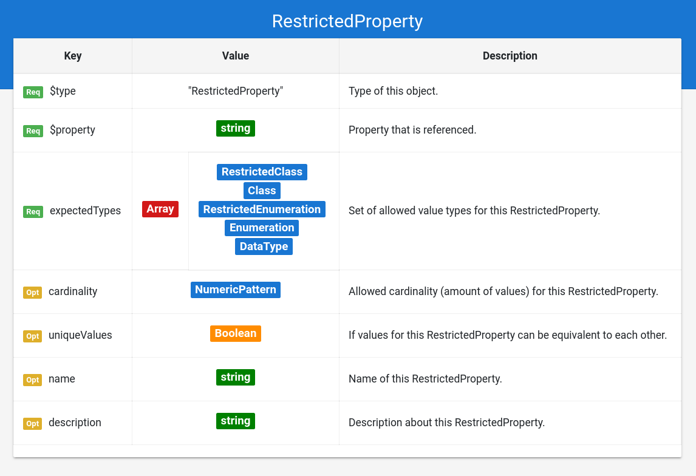

## Grammar Documentation for node type "RestrictedProperty"

This is a node specifying the usage of a restricted property, hence a property from Schema.org that has syntactic and semantic constraints.

### $type
**Required**. Has always the string "RestrictedProperty" as value.

Based on "@type" from JSON-LD (Indicates the type of the node/object). This value is a short form for the URI identifying this node type in the DS grammar.

### $property
**Required**. Has always a string as value.

Indicates the property from Schema.org which is referenced here. The property is specified in a short form instead of the URI ("name" instead of "https://schema.org/name").

### expectedTypes
**Required**. Has always an array as value.

Specifies the allowed classes and data types for this property. The values in this array must have one of the following $types:

*   RestrictedClass
*   Class
*   RestrictedEnumeration
*   Enumeration
*   DataType

### cardinality
**Optional**. Has always a string (numeric pattern) as value.

Specifies the allowed cardinality for this property. This numeric pattern has an own grammar to specify the allowed cardinality. See document "numericPattern_docu.md" for details. Examples:

"1-3" -> property must have at least 1 value and max. 3 values.

"(%2 & >5)" -> property must have values in a quantity that is a multiple of 2, and bigger than 5.

The default pattern for cardinality is **">=0"** (0 or more), as suggested by Schema.org, and is handled as such, if the option is not used.

### uniqueValues
**Optional**. Has a boolean as value.

Indicates if the values of this property can be equivalent to each other or not. Note that different data types may have the same "value"; A string with "true" is handled as equivalent to a boolean true. (discussion: should the data type also be the same?).

By default "uniqueValues" is set to **false**, and is handled as such if the option is not used.

### name
**Optional**. Has always a string as value.

Same as the property "name" from Schema.org (meta information about the entity).

### description
**Optional**. Has always a string as value.

Same as the property "description" from Schema.org (meta information about the entity).
