## Numeric Pattern

**A numeric pattern is a string which defines a valid set of numeric values**.

Such a numeric pattern is used in the DS vocabulary to define constraint on numeric values, the length of strings, or the allowed cardinality of properties.

Integers and Float values (simple float without exponent letter) can be used in numeric patterns. Spaces between characters are possible, but not necessary.

Expressions for this pattern include (Val stands for a value, Expr stands for an expression):

(note: because of markdown limitations the examples in table contain ⎮ instead of | (pipe) as symbol for "or" )

Expression | pattern syntax
------------ | -------------
Number | Val1
Range  | Val1 - Val2
More than excl.    | > Val1
Less than excl.   | < Val1
More than incl.   | >= Val1
Less than incl.  | <= Val1
MultipleOf  | % Val1
Or  | (Expr1 ⎮ Expr2 ⎮ ... ⎮ ExprN)
And  | (Expr1 & Expr2 & ... & ExprN)
Not  | !Expr1
   

Examples:

Numeric pattern | description
------------ | -------------
20 | equal 20
<4 | smaller than 4
>=5 | bigger or equal 5
%4 | multiple of 4
1-3  | between 1 and 3
(0 ⎮ 1)  | 0 or 1
(>1 & <10)  | bigger than 1 and smaller than 10
!0  | not 0
1-1.337 | between 1 and 1.337
((>2 & <10) ⎮ %3 ⎮ >9000) | multiple of 2 and less than 10, or multiple of 3, or bigger than 9000

#### Syntax diagram for numeric pattern

##### NumericPattern

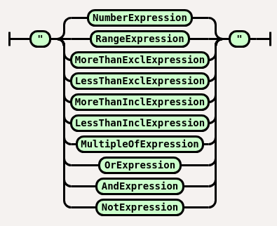

##### NumberExpression

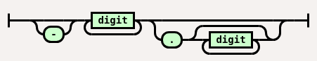

##### RangeExpression

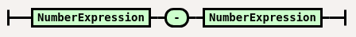

##### MoreThanExclExpression

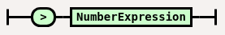

##### LessThanExclExpression

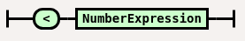

##### MoreThanInclExpression

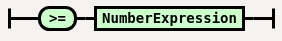

##### LessThanInclExpression

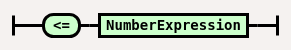

##### MultipleOfExpression

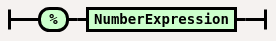

##### OrExpression

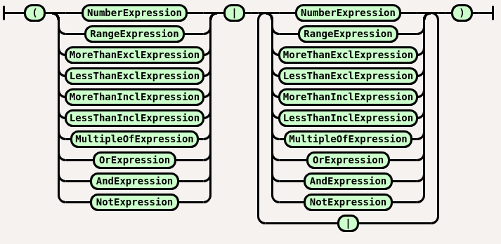

##### AndExpression

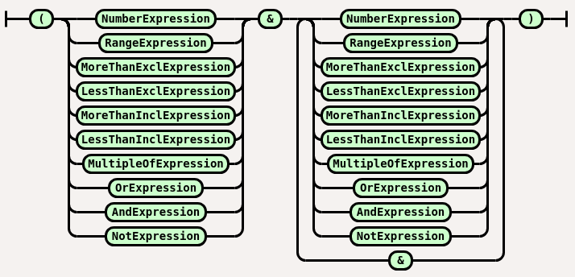

##### NotExpression

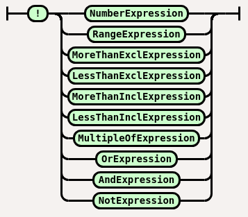
