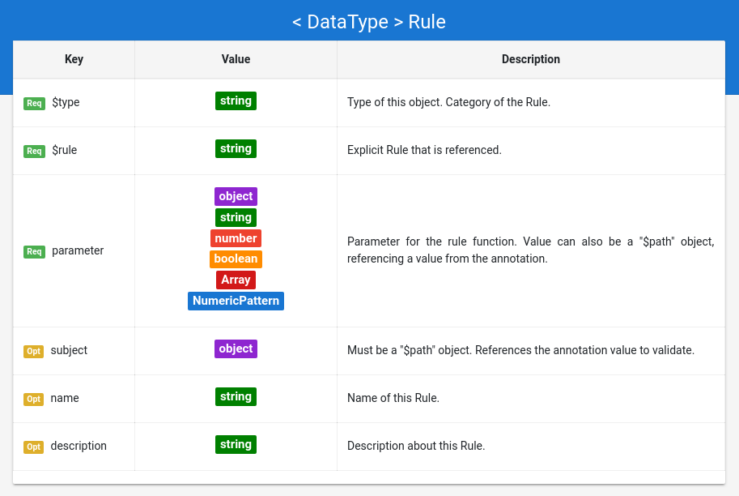

## Grammar Documentation for node type "DateRule"

```
Date: A date value in ISO 8691 date format. 
This ISO allows different formats but the following is encouraged:
[-]YYYY-MM-DD 
YYYY being the year, MM being the month, and DD being the day.
```

DateRules are rules that apply on values which have the data type "Date" from Schema.org.

The specific rule type is given by the value in the "$rule" property. The properties which rules can have are explained in the Meta_Rules.md document. Note that the "subject" property can be omitted, if the "$path" object has an empty JSON Pointer as value (see Meta_Rules.md for details).

However, the data type for the "parameter" depends on the "$rule" value (e.g. arguments for the rule function), and is explained in the following.



### equals

The "equals" rule checks if a given Date value (the validated value) matches a given Date.

```json
{
  "$type": "DateRule",
  "$rule": "equals",
  "subject": {
      "$path": "/startDate"
  },
  "parameter": "2018-02-20",
  "description": "The date must be the 20. Feb. of 2018, in ISO 8691 date format."
}
```

The parameter is a Date which serves as the second argument for the rule function. The validated subject must be the same as the given parameter.


### isBefore

The "isBefore" rule checks if a given Date value (the validated value) is chronologically before a given Date.

```json
{
  "$type": "DateRule",
  "$rule": "isBefore",
  "parameter": "2018-02-20",
  "description": "The date must be before the 20. Feb. of 2018, in ISO 8691 date format."
}
```

The parameter is a Date which serves as the second argument for the rule function. The validated subject must be chronologically before the given parameter.


### isAfter

The "isAfter" rule checks if a given Date (the validated value) is chronologically after a given Date.

```json
{
  "$type": "DateRule",
  "$rule": "isAfter",
  "parameter": "2018-02-20",
  "description": "The date must be after the 20. Feb. of 2018, in ISO 8691 date format."
}
```

The parameter is a Date which serves as the second argument for the rule function. The validated subject must be chronologically after the given parameter.


### isInSet

The "isInSet" rule checks if a given Date (the validated value) is in the given set of allowed values.

```json
{
  "$type": "DateRule",
  "$rule": "isInSet",
  "parameter": [
    "2018-02-20",
    "2006-12-15",
    "1995-03-12"
  ],
  "description": "The date must match one of the given values"
}
```

The parameter is an array which contains Dates, which are valid instances for a given Date (the validated subject).

### hasYear

The "hasYear" rule checks if a given Date (the validated value) has a value for the year, that is conform to a given numeric pattern.

```json
{
  "$type": "DateRule",
  "$rule": "hasYear",
  "parameter": ">2015",
  "description": "Year of the date must be later than 2015."
}
```

The parameter is a numeric pattern, that has to be matched by the year of a given Date (the validated subject).


### hasMonth

The "hasMonth" rule checks if a given Date (the validated value) has a value for the month, that is conform to a given numeric pattern.

```json
{
  "$type": "DateRule",
  "$rule": "hasMonth",
  "parameter": "1-3",
  "description": "The month of the date must match the numeric pattern -> Month must be between 1 and 3."
}
```

The parameter is a numeric pattern, that has to be matched by the month of a given Date (the validated subject).


### hasDay

The "hasDay" rule checks if a given Date (the validated value) has a value for the day, that is conform to a given numeric pattern.

```json
{
  "$type": "DateRule",
  "$rule": "hasDay",
  "parameter": "(15 | 30)",
  "description": "The day of the date must match the numeric pattern -> Day must be either 15 or 30."
}
```

The parameter is a numeric pattern, that has to be matched by the day of a given Date (the validated subject).