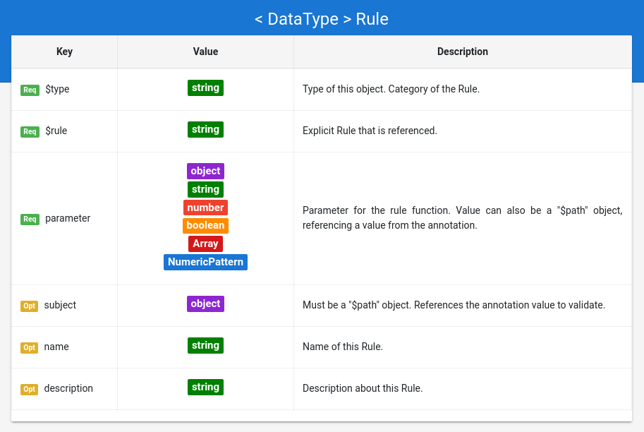

## Grammar Documentation for node type "TextRule"

TextRules are rules that apply on values which have the data type "Text" or "URL" from Schema.org. 

The specific rule type is given by the value in the "$rule" property. The properties which rules can have are explained in the Meta_Rules.md document. Note that the "subject" property can be omitted, if the "$path" object has an empty JSON Pointer as value (see Meta_Rules.md for details).

However, the data type for the "parameter" depends on the "$rule" value (e.g. arguments for the rule function), and is explained in the following.



### hasLength

The "hasLength" rule compares the length of a given Text (the validated subject) with a given numeric pattern. The constraint is fulfilled if the length of the string matches the numeric pattern.

```json
{
  "$type": "TextRule",
  "$rule": "hasLength",
  "subject": {
      "$path": "/name"
   },
  "parameter": "(>4 & <20)"
}
```

The parameter is a numeric pattern that serves as the second argument for the rule function. The constraint is fulfilled if the length of the string matches the numeric pattern.

### equals

The "equals" rule checks if a given Text (the validated subject) matches a given string. Based on https://www.ecma-international.org/ecma-262/6.0/#sec-abstract-equality-comparison

```json
{
  "$type": "TextRule",
  "$rule": "equals",
  "parameter": "Austria"
}
```

The parameter is a string which serves as the second argument for the rule function. The given Text (the validated subject) must be the same as the given parameter. The comparison is case sensitive!

### startsWith

The "startsWith" rule checks if a given Text (the validated subject) starts with a given string. Based on https://www.ecma-international.org/ecma-262/6.0/#sec-string.prototype.startswith

```json
{
  "$type": "TextRule",
  "$rule": "startsWith",
  "parameter": "+43"
}
```

The parameter is a string that serves as the second argument for the rule function. The given Text (the validated subject) must have the given parameter as substring at the start. The comparison is case sensitive!

### endsWith

The "endsWith" rule checks if a given Text (the validated subject) ends with a given string. Based on https://www.ecma-international.org/ecma-262/6.0/#sec-string.prototype.endswith

```json
{
  "$type": "TextRule",
  "$rule": "endsWith",
  "parameter": "hausen"
}
```

The parameter is a string that serves as the second argument for the rule function. The given Text (the validated subject) must have the given parameter as substring at the end. The comparison is case sensitive!

### contains

The "contains" rule checks if a given Text (the validated subject) includes a given string at any position. Based on https://www.ecma-international.org/ecma-262/6.0/#sec-string.prototype.includes

```json
{
  "$type": "TextRule",
  "$rule": "contains",
  "parameter": "0664"
}
```

The parameter is a string which serves as the second argument for the rule function. The given Text (the validated subject) must have the given parameter as substring at any position. The comparison is case sensitive!


### isInSet

The "isInSet" rule checks if a given Text (the validated subject) is in the given set of allowed values.

```json
{
  "$type": "TextRule",
  "$rule": "isInSet",
  "parameter": [
    "Austria",
    "Germany",
    "Switzerland"
  ]
}
```

The parameter is an array that contains strings, which are valid instances for the given Text (the validated subject).

### matchesPattern

The "matchesPattern" rule checks if a given Text (the validated subject) matches a given regular expression. Based on https://www.ecma-international.org/ecma-262/6.0/#sec-string.prototype.match
 
 The Regex pattern is expected to work with a javascript engine
 https://developer.mozilla.org/en-US/docs/Web/JavaScript/Guide/Regular_Expressions
 Note that the regex must be escaped so that it can be included as JSON value. The regex shall be unescaped before it can be passed to the regex validation function.

```json
{
  "$type": "TextRule",
  "$rule": "matchesPattern",
  "parameter": "^[a-zA-Z0-9.!#$%&'*+\/=?^_`{|}~-]+@[a-zA-Z0-9](?:[a-zA-Z0-9-]{0,61}[a-zA-Z0-9])?(?:\\.[a-zA-Z0-9](?:[a-zA-Z0-9-]{0,61}[a-zA-Z0-9])?)*$",
  "description": "email address using pattern according to RFC 5322"
}
```

The parameter is a regex that serves as the second argument for the rule function. The given Text (the validated subject) must match the regex in order to be valid.

### hasFormat

The "hasFormat" rule checks if a given Text (the validated subject) matches a given pre-defined format. Like the pattern constraint of JSON Schema, the pre-defined formats are based on specifications provided by official authorities (see https://json-schema.org/understanding-json-schema/reference/string.html) OR formats specified by Schema.org

```json
{
  "$type": "TextRule",
  "$rule": "hasFormat",
  "parameter": "email",
  "description": "email address validation with built in format according to RFC 5322"
}
```

The parameter is a string that serves as the second argument for the rule function. The passed "format" must be one of the pre-defined formats of the DS vocabulary.

Pre-defined Formats for the Domain Specification context SHOULD be based on properties and intangibles of Schema.org which expect a special string as value. (todo: investigate which formats are interesting)

*   https://schema.org/URL
*   email for https://schema.org/email
*   https://schema.org/Duration
*   https://schema.org/Distance
*   https://schema.org/Mass
*   https://schema.org/Energy
*   telephone number for https://schema.org/telephone