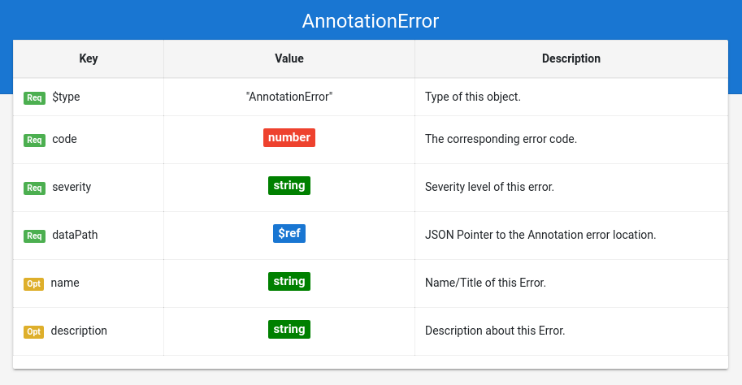
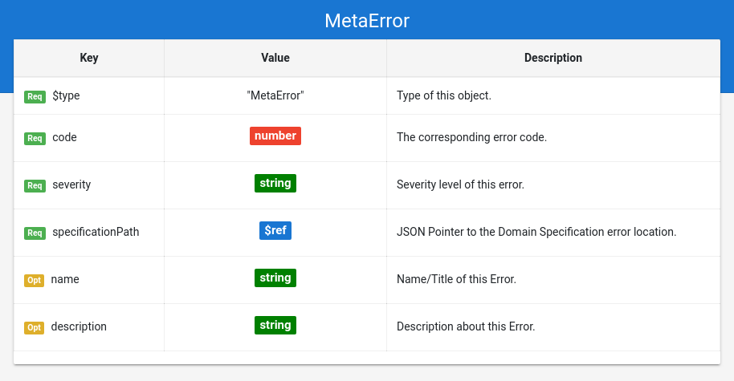
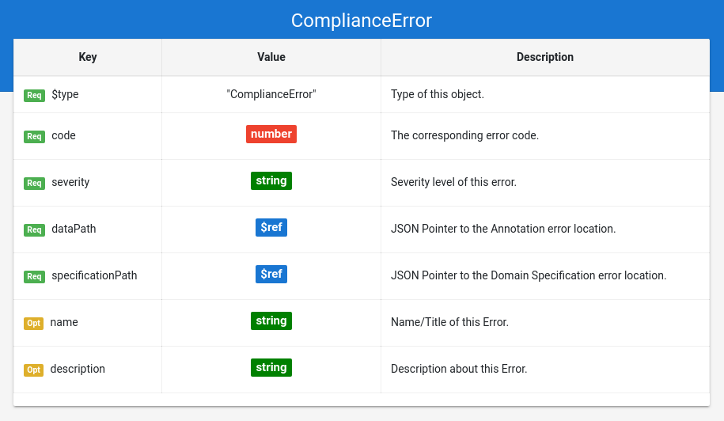

## Grammar Documentation for node type "Error"

A node specifying an Error detected during the validation.

There are 3 types of validation:

*   (Annotation Validation) General validation of an Annotation based on following specifications:
    *   JSON
    *   JSON-LD
    *   Schema.org vocabulary
*   (Meta Validation) Validation of a Domain Specification based on following specifications:
    *   JSON
    *   Schema.org vocabulary
    *   Domain Specifications vocabulary
*   (Domain specific Validation) Domain specific validation of a Schema.org annotation: Checks if a given Annotation is conform to all constraints defined in a given Domain Specification.

Errors detected during any kind of validation produce a corresponding error object. There is an error type for each validation type:

Validation type | error $type |  description
---|----|---
Annotation Validation | AnnotationError | Error detected during the general validation of the Annotation 
Meta Validation | MetaError | Error detected during the validation of the Domain Specification 
Domain specific Validation | ComplianceError | Error detected during the validation of the Annotation based on the Domain Specification

Errors must have a "dataPath" and/or a "specificationPath", depending of their $type. These paths contain JSON Pointer to the part of the input document, where the error occurred. "dataPath" points to a part of the annotation, whereas "specificationPath" points to a part of the domain specification.

*   An "AnnotationError" has a "dataPath".
*   A "MetaError" has a "specificationPath".
*   A "ComplianceError" has a "dataPath" AND a "specificationPath".

Example for an AnnotationError:

```json
{
    "$type": "AnnotationError",
    "severity": "Error",
    "code": 302,
    "name": "Nonconform @type",
    "description": "Used @type is nonconform to Schema.org",
    "dataPath": {
      "$ref": "/annotation/starRating"
    }
}
```





Example for a MetaError:

```json
{
    "$type": "MetaError",
    "severity": "Warning",
    "code": 405,
    "name": "Specification Node has an unknown property (not assigned to an extension)",
    "description": "Specification Node has an unknown property (not assigned to an extension)",
    "specificationPath": {
      "$ref": "/domainSpecification/classes/0/properties/3"
    }
}
```





Example for a ComplianceError:

```json
{
  "$type": "ComplianceError",
  "severity": "Error",
  "code": 505,
  "name": "Nonconform range",
  "description": "Property has a value with a @type/DataType that is nonconform to the DS.",
  "specificationPath": {
    "$ref": "/domainSpecification/classes/0/properties/0"
  },
  "dataPath": {
    "$ref": "/annotation/telephone/1"
  }
}
```




All error types share following properties:

### severity
**Required**. Has always a string as value.

The severity level of the error. There are following severity levels defined in the Domain Specification vocabulary:

*   **Informational**: If the "error" encountered is not problematic at all, but the incident should be reported. e.g. A $path object for a rule can not be resolved. Rule can not be checked, which does not necessary mean, that there is an error with the annotation. This error type does NOT cause an "invalid" result ("isValid": false).
*   **Warning**: For errors or syntax/semantic variations that are accepted/allowed by specifications. e.g. Schema.org states that a string value is always an option, even if they do not specifically state strings as a range. This error type does NOT cause an "invalid" result ("isValid": false).
*   **Error**: The most general error type. e.g. Annotation misses a property that is required by the Domain Specification. This error type causes an "invalid" result ("isValid": false).
*   **Critical**: A major error that should not occur at all. e.g. The input is not valid JSON. This error type causes an "invalid" result ("isValid": false).

### code
**Required**. Has always a number as value.

The error code of the error. These error codes should help to identify and categorize errors. The error codes of Domain Specifications are inspired by HTTP status codes. See "ErrorCodes_docu.md" for details. The most generic error codes are following:

*   100 - JSON related Error -> annotation validation and meta validation
*   200 - JSON-LD related Error -> annotation validation
*   300 - Schema.org related Error -> annotation validation
*   400 - Domain Specification related Error -> meta validation
*   500 - Compliance related Error -> domain specific validation
*   550 - Compliance of semantic rule related Error -> domain specific validation

There is also the error code 600 which is reserved for the meta validation of validation reports, but this is omitted for now.

### name
**Optional**. Has always a string as value.

Same as the property "name" from Schema.org (meta information about the entity).
Can be seen as the name or title of the error.

### description
**Optional**. Has always a string as value.

Same as the property "description" from Schema.org (meta information about the entity).
Describes the error occurred and may give detailed information.