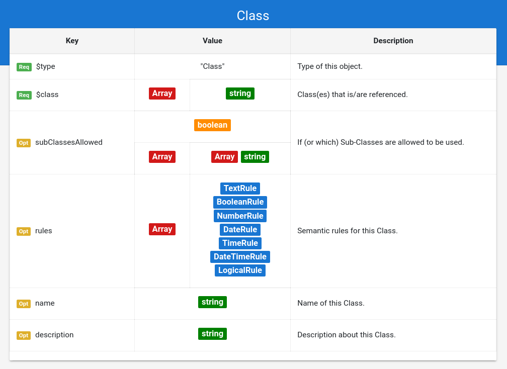

# Grammar Documentation for node type "Class"

This is a generic node specifying the usage of standard class from Schema.org. By standard it is meant that there are no syntactic constraints on the annotation on how to use this class at the given position -&gt; any properties of this class can be used, with any cardinality. There are no further syntactic restrictions on the properties and their values. Semantic restrictions are possible, but not necessary.



## $type

**Required**. Has always string "Class" as value.

Based on "@type" from JSON-LD \(Indicates the type of the node/object\). This value is a short form for the URI identifying this node type in the DS grammar.

## $class

**Required**. Has an array of strings as value.

The values in this array are always strings, which indicate the class\(es\) \(multi-typed entities\) from Schema.org which is/are referenced here. The classes are specified in a shortform instead of the URI \("Hotel" instead of "[https://schema.org/Hotel](https://schema.org/Hotel)"\).

## subClassesAllowed

**Optional**. Has a boolean, or an array as value.

Indicates if subClasses of this class\(es\) are allowed to be used. e.g. A "LocalBusiness" with "subClassesAllowed": false, allows an entity with the @type "LocalBusiness", but not one with @type "Hotel".

Following possible values:

* **false**: The class\(es\) specified in $class must be used.
* **true**: Any subclasses \(and their subclasses\) of the class\(es\) specified in $class can be used in any combination. For multi-typed entities it also could be possible to add any additional classes, since the entity would still be a valid subclass in the perspective of Schema.org
* **Array of $class definitions**: Any class\(es\) array from this array can be seen as a valid type for this definition. Note that the items of this array are again array, which can contain more than 1 class, to allow multi-typed entities.

The "Class" node does not specify restrictions on the allowed properties of the instance. By that logic, any subclasses are allowed to use any of their additional properties according to Schema.org

By default "subClassesAllowed" is set to **false**, and is handled as such if the option is not used.

Examples:

No subclasses allowed \(value is boolean\)

```javascript
{
    "$type": "Class",
    "$class": [
      "LodgingBusiness",
      "Restaurant"
    ],
    "subClassesAllowed": false
}
```

All subclasses allowed \(value is boolean\)

```javascript
{
    "$type": "Class",
    "$class": [
      "LodgingBusiness",
      "Restaurant"
    ],
    "subClassesAllowed": true
}
```

A specific set of subclasses is allowed \(value is array of classes-arrays \(multi-typed entities\)\)

```javascript
{
    "$type": "Class",
    "$class": [
      "LodgingBusiness",
      "Restaurant"
    ],
    "subClassesAllowed": [
        ["Motel", "Restaurant"],
        ["Restaurant"],
        ["Hotel", "Restaurant"],
        ["Resort", "Restaurant"]
    ]
}
```

## rules

**Optional**. Has an array of rules as value.

Each value in the array must be an Object containing a rule. Each rule must be valid for the validated value instance, so that the semantic check is successful. More details in "Meta\_Rules.md".

## name

**Optional**. Has always a string as value.

Same as the property "name" from Schema.org \(meta information about the entity\).

## description

**Optional**. Has always a string as value.

Same as the property "description" from Schema.org \(meta information about the entity\).

