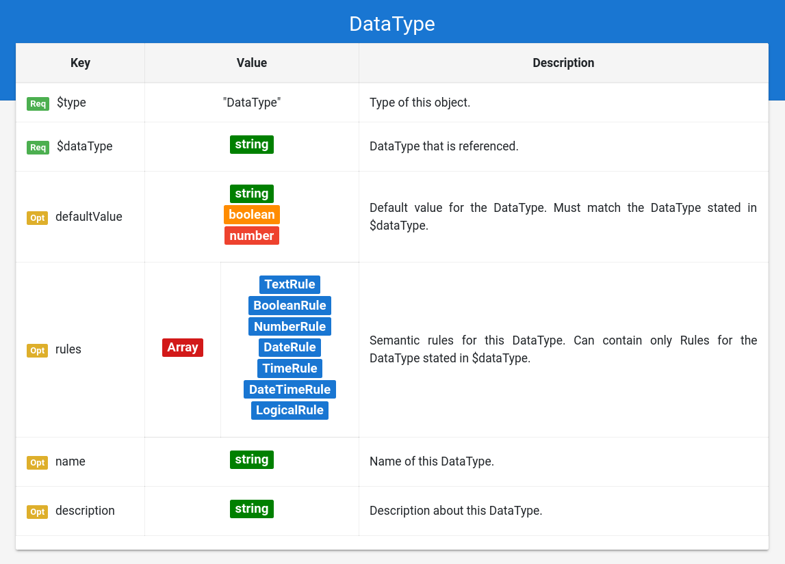

# Grammar Documentation for node type "DataType"

This is a node specifying the usage of a certain data type of Schema.org.

## $type

**Required**. Has always the string "DataType" as value.

Based on "@ type" from JSON-LD \(Indicates the type of the node/object\). This value is a short form for the URI identifying this node type in the DS grammar.

## $dataType

**Required**. Has an string as value.

Indicates the data type from Schema.org which is referenced here. The data type is specified in a shortform instead of the URI \("Boolean" instead of "[https://schema.org/Boolean](https://schema.org/Boolean)"\).

Possible data types:

* Text
* URL
* Boolean
* Number
* Integer
* Float
* Date
* Time
* DateTime

## defaultValue

**Optional**. Has always a value that has the data type described in $dataType.

A default value for the instance of this data type.

## rules

**Optional**. Has an array of rules as value.

Each value in the array MUST be an object containing a Rule with a $type valid for the $dataType of the parent object \(see datatype mapping\). Each rule must be valid for the annotation instance, so that the semantic check is successful.

| Schema.org DataType | Applicable Rule Type |
| :--- | :--- |
| Text | TextRule |
| URL | TextRule |
| Boolean | BooleanRule |
| Number | NumberRule |
| Integer | NumberRule |
| Float | NumberRule |
| Date | DateRule |
| Time | TimeRule |
| DateTime | DateTimeRule |
| All | ComplexRule |

LogicalRules for a dataType are supposed to contain only Rules which are applicable to that dataType.

## name

**Optional**. Has always a string as value.

Same as the property "name" from Schema.org \(meta information about the entity\).

## description

**Optional**. Has always a string as value.

Same as the property "description" from Schema.org \(meta information about the entity\).

