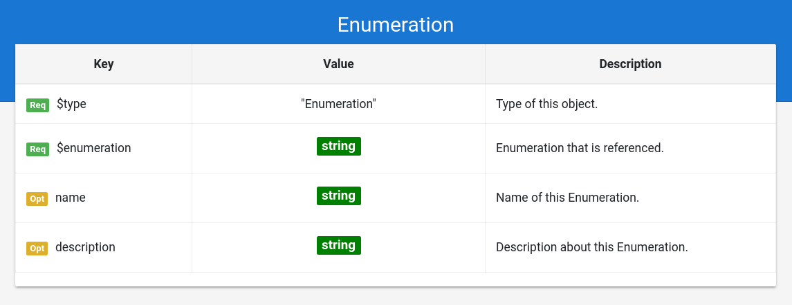

# Grammar Documentation for node type "Enumeration"

This is a node specifying the usage of a standard enumeration from Schema.org. By standard it is meant that there are no constraints on the allowed instance values for this enumeration. Any value stated by Schema.org as enumeration value instance for this enumeration is valid.

## $type

**Required**. Has always the string "Enumeration" as value.

Based on "@type" from JSON-LD \(Indicates the type of the node/object\). This value is a short form for the URI identifying this node type in the DS grammar.

## $enumeration

**Required**. Has always a string as value.

Indicates the enumeration from Schema.org which is referenced here. The enumeration is specified in a short form instead of the URI \("BookFormatType" instead of "[https://schema.org/BookFormatType](https://schema.org/BookFormatType)"\).

## name

**Optional**. Has always a string as value.

Same as the property "name" from Schema.org \(meta information about the entity\).

## description

**Optional**. Has always a string as value.

Same as the property "description" from Schema.org \(meta information about the entity\).

