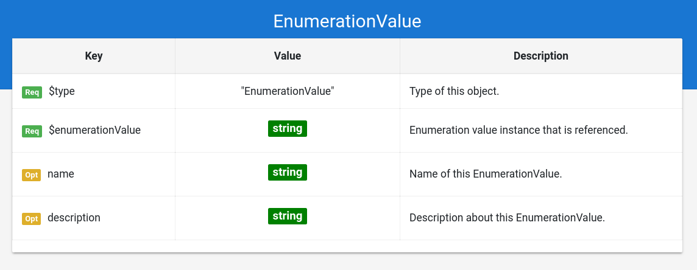

# Grammar Documentation for node type "EnumerationValue"

This is a node specifying the usage of a standard enumeration value instance from Schema.org. By standard it is meant that this value is stated as an enumeration value instance by Schema.org. e.g. [https://schema.org/EBook](https://schema.org/EBook) is an enumeration value instance for the enumeration [https://schema.org/BookFormatType](https://schema.org/BookFormatType)

## $type

**Required**. Has always the string "EnumerationValue" as value.

Based on "@type" from JSON-LD \(Indicates the type of the node/object\). This value is a short form for the URI identifying this node type in the DS grammar.

## $enumerationValue

**Required**. Has always a string as value.

Indicates the enumeration value instance from Schema.org which is referenced here. The enumeration value is specified in a short form instead of the URI \("EBook" instead of "[https://schema.org/EBook](https://schema.org/EBook)"\).

## name

**Optional**. Has always a string as value.

Same as the property "name" from Schema.org \(meta information about the entity\).

## description

**Optional**. Has always a string as value.

Same as the property "description" from Schema.org \(meta information about the entity\).

