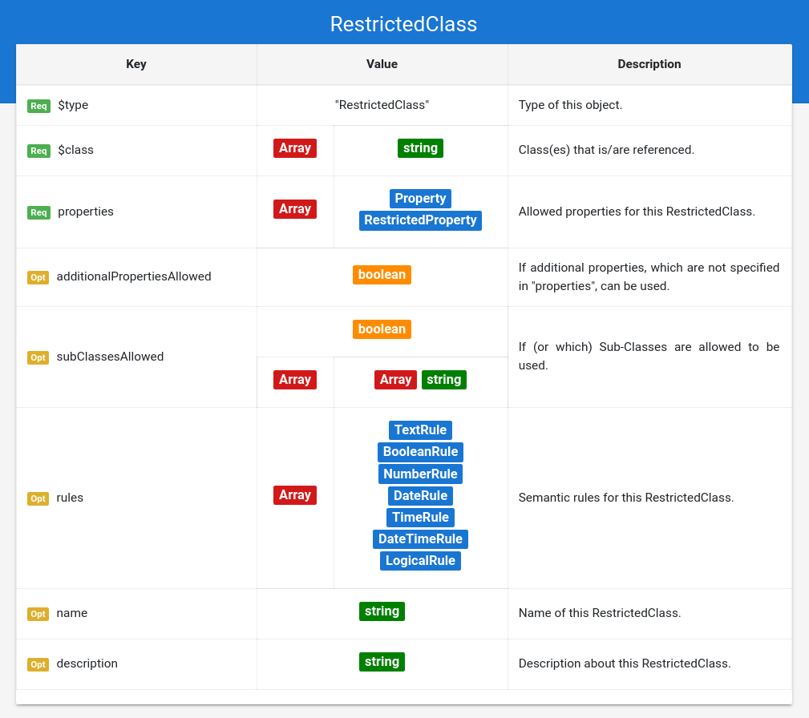

# Grammar Documentation for node type "RestrictedClass"

This is a node specifying the usage of a restricted class, hence a class from Schema.org that has syntactic constraints. The definition of semantic constraints is also possible through the usage of rules.



## $type

**Required**. Has always the string "RestrictedClass" as value.

Based on "@type" from JSON-LD \(Indicates the type of the node/object\). This value is a short form for the URI identifying this node type in the DS grammar.

## $class

**Required**. Has an array of strings as value.

The values in this array are always strings, which indicate the class or classes \(multi-typed entities\) from Schema.org which is/are referenced here. The classes are specified in a short form instead of the URI \("Hotel" instead of "[https://schema.org/Hotel](https://schema.org/Hotel)"\).

## properties

**Required**. Has always an array as value.

Specifies the allowed properties for this class. Each object in that array MUST have the $type "RestrictedProperty" or "Property".

## additionalPropertiesAllowed

**Optional**. Has a boolean as value.

Based on "sh:closed" from SHACL, and "additionalProperties" from JSON Schema. Not to be confused with [https://schema.org/additionalProperty](https://schema.org/additionalProperty)

Indicates if additional properties from the Schema.org vocabulary \(which have not been specified in the "properties" Array, and are in the range of the class/classes\) are allowed in the annotation instance. These properties have no further restriction, they are validated as if there were standard "Property" nodes.

By default "additionalPropertiesAllowed" is set to **false**, and is handled as such if the option is not used.

## subClassesAllowed

**Optional \(not recommended\)**. Has a boolean, or an array as value.

Indicates if \(or which\) subClasses of this class\(es\) are allowed to be used. e.g. A "LocalBusiness" with "subClassesAllowed": false, allows an entity with the @type "LocalBusiness", but not one with @type "Hotel".

Following possible values:

* **false**: The class\(es\) specified in $class must be used.
* **true**: Any subclasses \(and their subclasses\) of the class\(es\) specified in $class can be used in any combination. For multi-typed entities it also could be possible to add any additional classes, since the entity would still be a valid subclass in the perspective of Schema.org
* **Array of $class definitions**: Any class\(es\) array from this array can be seen as a valid type for this definition. Note that the items of this array are again array, which can contain more than 1 class, to allow multi-typed entities.

Any restrictions for the specified classes are also valid for the subclasses. The usage of this option is **only recommended** if all syntactic and semantic restrictions are the same for a specific set of subclasses. In any other case it is recommended to define "RestrictedClass" nodes for the subclasses and add them to the "expectedTypes" of the parent property. \(Note that similar properties and restrictions can \(and should\) be reused using "$ref"-objects\)

By default "subClassesAllowed" is set to **false**, and is handled as such if the option is not used.

Examples:

No subclasses allowed \(value is boolean\)

```javascript
{
    "$type": "RestrictedClass",
    "$class": [
      "LodgingBusiness",
      "Restaurant"
    ],
    "subClassesAllowed": false
}
```

All subclasses allowed \(value is boolean\)

```javascript
{
    "$type": "RestrictedClass",
    "$class": [
      "LodgingBusiness",
      "Restaurant"
    ],
    "subClassesAllowed": true
}
```

A specific set of subclasses is allowed \(value is array of classes-arrays \(multi-typed entities\)\)

```javascript
{
    "$type": "RestrictedClass",
    "$class": [
      "LodgingBusiness",
      "Restaurant"
    ],
    "subClassesAllowed": [
        ["Motel", "Restaurant"],
        ["Restaurant"],
        ["Hotel", "Restaurant"],
        ["Resort", "Restaurant"]
    ]
}
```

## rules

**Optional**. Has an array of rules as value.

Each value in the array must be an Object containing a rule. Each rule must be valid for the validated value instance, so that the semantic check is successful. More details in "Meta\_Rules.md".

## name

**Optional**. Has always a string as value.

Same as the property "name" from Schema.org \(meta information about the entity\).

## description

**Optional**. Has always a string as value.

Same as the property "description" from Schema.org \(meta information about the entity\).

