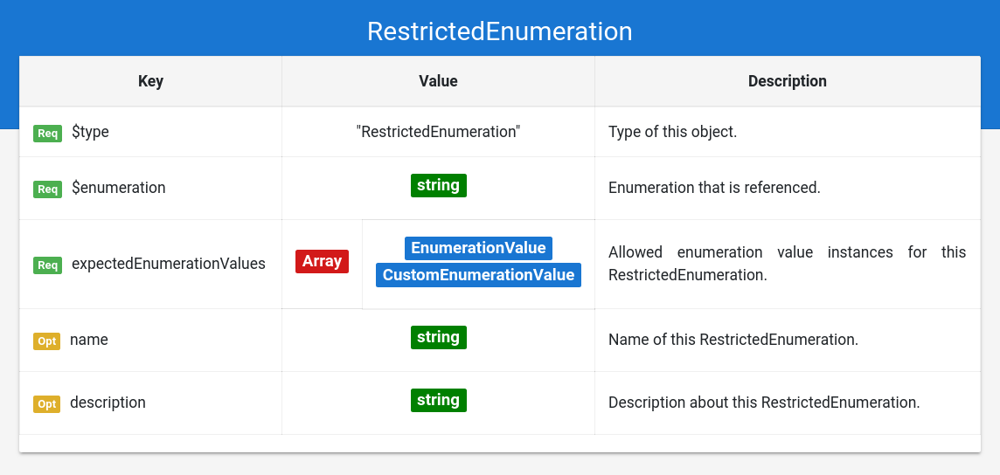

# Grammar Documentation for node type "RestrictedEnumeration"

This is a node specifying the usage of a restricted enumeration, hence an enumeration from Schema.org that has constraints on the allowed instance values \(Which enumeration instances are allowed\).

## $type

**Required**. Has always the string "RestrictedEnumeration" as value.

Based on "@type" from JSON-LD \(Indicates the type of the node/object\). This value is a short form for the URI identifying this node type in the DS grammar.

## $enumeration

**Required**. Has always a string as value.

Indicates the enumeration from Schema.org which is referenced here. The enumeration is specified in a short form instead of the URI \("BookFormatType" instead of "[https://schema.org/BookFormatType](https://schema.org/BookFormatType)"\).

## expectedEnumerationValues

**Required**. Has always an array as value.

Specifies the allowed enumeration instances for this enumeration. The values in this array must have one of the following $types:

* EnumerationValue
* CustomEnumerationValue

## name

**Optional**. Has always a string as value.

Same as the property "name" from Schema.org \(meta information about the entity\).

## description

**Optional**. Has always a string as value.

Same as the property "description" from Schema.org \(meta information about the entity\).

