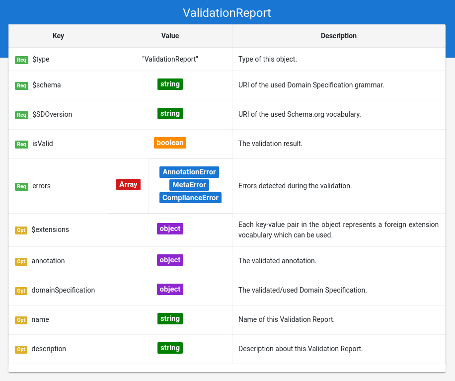

# Grammar Documentation for node type "VerificationReport"

This is the root node of a verification report. It specifies used vocabularies and meta information about the verification report. It also serves as container for the verification errors and the used documents \(DomainSpecification and/or Annotation\).

There are 3 types of verification:

* \(Annotation verification\) General verification of an Annotation based on following specifications:
  * JSON
  * JSON-LD
  * Schema.org vocabulary
* \(Meta verification\) verification of a Domain Specification based on following specifications:
  * JSON
  * Schema.org vocabulary
  * Domain Specifications vocabulary
* \(Domain specific verification\) Domain specific verification of a Schema.org annotation: Checks if a given Annotation is conform to all constraints defined in a given Domain Specification.

A verification report is used as a result document for any of these verification types. It is also possible to create a verification report for multiple types of verifications at the same time, e.g. before a domain specific verification can be executed, it should be checked if the input annotation is a valid JSON-LD document \(If there is a lexical JSON error, the file can not be interpreted as an annotation, and consequently not be analysed during the domain specific verification.\)

Errors detected during any kind of verification produce a corresponding error object. There is an error type for each verification type:

| verification type | error $type | description |
| :--- | :--- | :--- |
| Annotation verification | AnnotationError | Error detected during the general verification of the Annotation |
| Meta verification | MetaError | Error detected during the verification of the Domain Specification |
| Domain specific verification | ComplianceError | Error detected during the verification of the Annotation based on the Domain Specification |

## $type

**Required**. Has always the string "verificationReport" as value.

Based on "@ type" from JSON-LD \(Indicates the type of the node/object\). This value is a short form for the URI identifying this node type in the DS grammar.

## $schema

**Required**. Has always a string \(URI\) as value.

Based on "$schema" from JSON Schema \(Indicates the vocabulary for this schema AND! the version of the vocabulary\). The URI must point to a valid DS grammar AND to the used version. e.g. "[http://ontologies.sti-innsbruck.at/dsv-json/1.1/](http://ontologies.sti-innsbruck.at/dsv-json/1.1/)"

This attribute is important for the meta verification of the verification report. \(Yes, this is also possible\)

## $SDOversion

**Required**. Has always a string \(URI\) as value.

Based on the property "schemaVersion" from Schema.org. Value must always be an URI with the used Schema.org version. e.g. "[http://schema.org/version/3.4/](http://schema.org/version/3.4/)".

This attribute is important for the verification of annotations, and the meta verification of the Domain Specification. e.g. It can be possible to verify a Domain Specification which is based on an older Schema.org version, to check if it still would be a valid Domain Specification for a newer Schema.org version.

As for the domain specific verification, the used Schema.org version should be the same stated by the used Domain Specification.

## isValid

**required**. Has always a boolean or undefined as value.

States the verification result as a boolean. The value may be undefined if the verification could not be executed, e.g. there was an execution error.

## errors

**required**. Has always an array with error objects as value.

Contains all errors encountered during the verification. If there were no errors, then the array is empty. See "Error\_docu.md" for details.

## $extensions

**Optional**. Has always an object as value. Keys and values define used extension vocabularies.

Basically the same as for Domain Specifications: Allows the usage of additional properties in the verification Report, based on extensions.

## annotation

**optional**. Has always the verifyd annotation as value. This value may be a string, if there was a lexical error during the verification of this annotation \(string can not be interpreted as JSON\)

The annotation SHOULD be present in the verification report, so that errors can use JSON Pointers to reference the part of the annotation where the error occurred. It also makes the verification result semantically independent of other documents.

The usage of external references \(e.g. external JSON Pointer\) is also within the realms of possibility.

## domainSpecification

**optional**. Has always the verifyd/used Domain Specification as value. This value may be a string, if there was a lexical error during the verification of this Domain Specification \(string can not be interpreted as JSON\)

The Domain Specification SHOULD be present in the verification report, so that errors can use JSON Pointers to reference the part of the Domain Specification where the error occurred. It also makes the verification result semantically independent of other documents.

The usage of external references \(e.g. external JSON Pointer\) is also within the realms of possibility.

## name

**Optional**. Has always a string as value.

Same as the property "name" from Schema.org \(meta information about the entity\).

## description

**Optional**. Has always a string as value.

Same as the property "description" from Schema.org \(meta information about the entity\).

